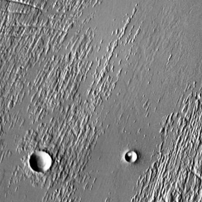
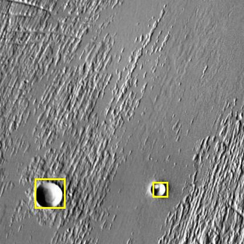
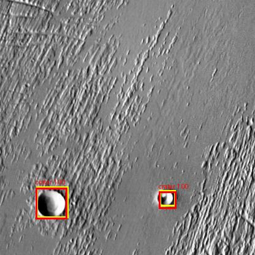

# Vision-Transformer-Based Lunar Crater Detection: Outperforming Convolutional Neural Networks on Multi-Scale Crater Mapping

An end-to-end, anchor-free deep learning framework for lunar crater detection using the **DEtection TRansformer (DETR)**. This project evaluates DETR against traditional CNN-based architectures (Faster R-CNN and RetinaNet) on the **[Roboflow Lunar Crater Dataset](https://universe.roboflow.com/crater-zqpjg/crater-vrqmn)**, achieving state-of-the-art results particularly in the detection of small-scale craters.

---

## 📝 Abstract & Project Overview
Automated Crater Detection Algorithms (CDAs) are essential for geological mapping, planetary surface age estimation (via size-frequency distributions), and safe landing site selection. While CNN-based detectors (like Faster R-CNN and RetinaNet) have driven recent progress, they face limitations due to:
1. **Anchor Dependency:** Hand-tuned anchors struggle with power-law size distributions.
2. **NMS Post-processing:** Can suppress valid overlapping crater detections.
3. **Local Receptive Fields:** Miss global context, leading to poor performance on degraded/small-scale craters.

This project introduces **DETR (DEtection TRansformer)** for anchor-free, end-to-end lunar crater mapping. By reformulating object detection as a direct set prediction problem with Hungarian bipartite matching, DETR leverages global self-attention to significantly outperform CNN baselines.

---

## 🚀 Key Experimental Findings
* **DETR Default** outperforms Faster R-CNN and RetinaNet by achieving a mean Average Precision ($mAP_{0.5:0.95}$) of **0.6638** (vs. 0.6134 for Faster R-CNN and 0.5582 for RetinaNet).
* **Small-Scale Crater Detection:** DETR improves $mAP_{small}$ to **0.5306** (a 6.29% absolute increase over Faster R-CNN and 10.22% over RetinaNet), resolving a long-standing challenge in planetary CDAs.
* **Query Optimization:** Restricting queries to **50** (to match the expected crater density) optimizes matching stability, achieving a peak $mAP_{0.5:0.95}$ of **0.6672** and a small-crater mAP of **0.5445**, while reducing inference time.
* **Inference Speed:** DETR (queries=50) performs inference on the test set of 357 images in **15.4 seconds** (~43ms/image), which is faster than both RetinaNet (18.0s) and Faster R-CNN (20.0s).

---

## 🛠️ Tech Stack & Dependencies
The environment is managed via `uv`. The project requires **Python >= 3.14** and uses CUDA 12.8 acceleration.
Key dependencies listed in `pyproject.toml`:
* **Core ML/DL:** `torch>=2.11.0`, `torchvision>=0.26.0` (with PyTorch CUDA 12.8 wheel support)
* **Model Architectures:** `transformers>=5.12.0` (Hugging Face DETR implementation), `timm>=1.0.27`
* **Evaluation:** `torchmetrics[detection]>=1.9.0`
* **Data & Setup:** `roboflow>=1.3.10`, `scipy>=1.17.1`, `python-dotenv>=1.2.2`, `ipykernel>=7.3.0`

---

## 📊 Results Summary

### 1. Model Comparison Table
| Metric | RetinaNet Baseline | Faster R-CNN Baseline | DETR (Default) |
| :--- | :---: | :---: | :---: |
| **mAP@0.5:0.95** | 0.5582 | 0.6134 | 0.6638 |
| **mAP@0.5** | 0.8254 | 0.8684 | 0.8805 |
| **mAP@0.75** | 0.2910 | 0.3583 | 0.4470 |
| **mAP (Small)** | 0.4284 | 0.4677 | 0.5306 |
| **mAP (Medium)** | 0.7703 | 0.7928 | 0.8470 |
| **mAP (Large)** | 0.8746 | 0.9178 | 0.9482 |
| **F1-Score** | 0.6339 | 0.6622 | 0.7214 |
| **Inference Time (s)** | 18.0s | 20.0s | 15.8s |

### 2. DETR Ablation Studies

#### A. Effect of Model Depth (Encoder/Decoder Layers)
| Depth ($d$) | mAP@0.5:0.95 | mAP (Small) | mAP (Medium) | mAP (Large) | Inference Time (s) |
| :---: | :---: | :---: | :---: | :---: | :---: |
| **3** | 0.4780 | 0.3161 | 0.7073 | 0.8447 | 15.0s |
| **4** | 0.6305 | 0.5080 | 0.8109 | 0.9362 | 15.3s |
| **5** | 0.6307 | 0.5005 | 0.8124 | 0.9454 | 15.4s |
| **6 (Default)** | 0.6638 | 0.5306 | 0.8470 | 0.9482 | 15.8s |

#### B. Effect of Object Queries count ($N$)
| Queries ($N$) | mAP@0.5:0.95 | mAP (Small) | mAP (Medium) | mAP (Large) | Inference Time (s) |
| :---: | :---: | :---: | :---: | :---: | :---: |
| **50** | **0.6672** | **0.5445** | 0.8398 | 0.9531 | 15.4s |
| **100 (Default)** | 0.6638 | 0.5306 | 0.8470 | 0.9482 | 15.8s |
| **150** | 0.5774 | 0.4577 | 0.7657 | 0.9436 | 15.8s |

---

## 📂 Project Structure
```bash
├── sample_annotated_images/ # Ground truth annotation samples
├── sample_predicted_images/ # Model prediction result samples
├── sample_test_images/      # Unlabeled raw test images
├── pyproject.toml           # Technical dependencies and index configuration
├── uv.lock                  # Lockfile for reproducible env setup
├── main.py                  # Entrypoint placeholder
├── create-logs.py           # Script to parse text logs and plot curves
├── sample-detection-detr.py # Python training & eval script for DETR
└── lunar-crater-detection-*.ipynb # Jupyter notebooks for baseline & ablation runs
```

---

## ⚙️ Setup and Installation

### 1. Install `uv`
This project uses `uv` for fast environment and dependency resolution. Install it using:

**Windows (PowerShell):**
```powershell
powershell -ExecutionPolicy ByPass -c "irm https://astral.sh/uv/install.ps1 | iex"
```

**Linux / macOS:**
```bash
curl -LsSf https://astral.sh/uv/install.sh | sh
```

### 2. Set Up Environment
Create a virtual environment and install the required dependencies:
```bash
uv venv
# Activate env:
# Windows (cmd): .venv\Scripts\activate.bat
# Windows (PowerShell): .venv\Scripts\Activate.ps1
# Linux/macOS: source .venv/bin/activate

# Install dependencies from pyproject.toml
uv pip install -r pyproject.toml
```

### 3. API Keys Configuration
Create a `.env` file in the root directory and add your Roboflow API key to download the dataset automatically:
```env
ROBOFLOW_API_KEY=your_api_key_here
```

---

## 💻 Running the Code

### Jupyter Notebooks
You can explore training and testing steps for each model baseline and ablation setup in the provided notebooks:
* `lunar-crater-detection-baseline-retinanet.ipynb`
* `lunar-crater-detection-baseline-faster-r-cnn.ipynb`
* `lunar-crater-detection-detr.ipynb` (Default configuration)
* `lunar-crater-detection-detr-num-queries-50.ipynb` (Best performing configuration)
* `lunar-crater-detection-detr-depth-*.ipynb`

---

## 📊 Qualitative Results

Below is a comparison of a representative test sample showing the raw input image, the ground-truth annotations, and the predictions from the DETR model:

| Raw Test Image | Ground Truth | DETR Prediction |
| :---: | :---: | :---: |
|  |  |  |

* **Ground Truth (Yellow Boxes):** Expert hand-labeled crater boundaries.
* **Predictions (Red Boxes):** High-confidence detections from our model, illustrating robustness in identifying small-scale and overlapping craters.

