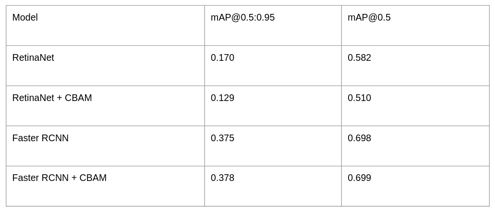

# Lunar Crater Detection
This project aims to detect craters on the lunar surface using RetinaNet, Faster RCNN and convolutional block attention module (CBAM). We implemented both Faster RCNN and RetinaNet with CBAM on the FPN outputs in PyTorch and trained them on an annotated dataset that we curated from ISRO's OHRC dataset.

Here are the results we obtained:

